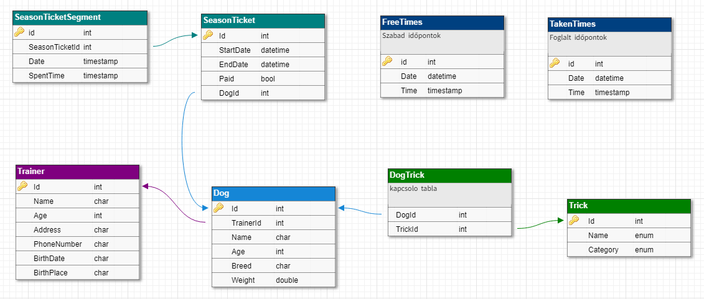

# Dog_training_application

# Eötvös Lóránd University - project for Project Tools Subject

Description in hungarian:

## Kutya kiképzést segítő webes alkalmazás

Ez egy webes alkalmazás, ami lehetővé teszi az oktató és a kutyatulajdonos
könnyebb kommunikációját, a kutya fejlődésének dokumentálását (amit
különböző statisztikák\diagramok által vannak jelezve) és egyéb
adminisztratív dolgok kényelmesebb számontartását.

Ezen alkalmazás segítségével a kutyatulajdonosok pl. bérletet válthatnak
kedvenceiknek, amiket tetszőleges időpontban használhatják fel. A
kiképzésnek különböző szintjei vannak, ha a kedvencünk ezen szinteken
meglépi, az alkalmazásban ezt jelezhetjük (a gazdi saját tapasztalatai,
tesztjei alapján, bepipálhatja kutyája haladását, feltételezhetően miután
tesztelte a kutyaiskolában tanultakat). Ha a kedvencünk egy feladatcsoport
minden egyes feladatát teljesítette, csak abban az esetben léphet a
következő szintre.

### 1. Adatbázis terv:

  

### 2. Program felépítése
 - **api**: Service Interface
	- DogService
	- TrainerService
 - **services**
	- DogServiceImpl
	- TrainerServiceImpl
 - **controllers**
	- DogController 
	- TrainerController
 - **entities**
	- Dog
	- Trainer
 - **repositories**
	- DogRepository
	- TrainerRepository
  
  ### 3. Végpontok
 - **GET/** 
 	> főoldal
 - **GET/dog** 
 	> összes kutyát megjelenítő oldal
 - **GET/dog/{dogId}** 
 	> egy kutya megjelenítése
 - **GET/trainer** 
 	> oktatók kilistázása
 - **GET/trainer/{trainerId}** 
 	> egy oktató megjelenítése
